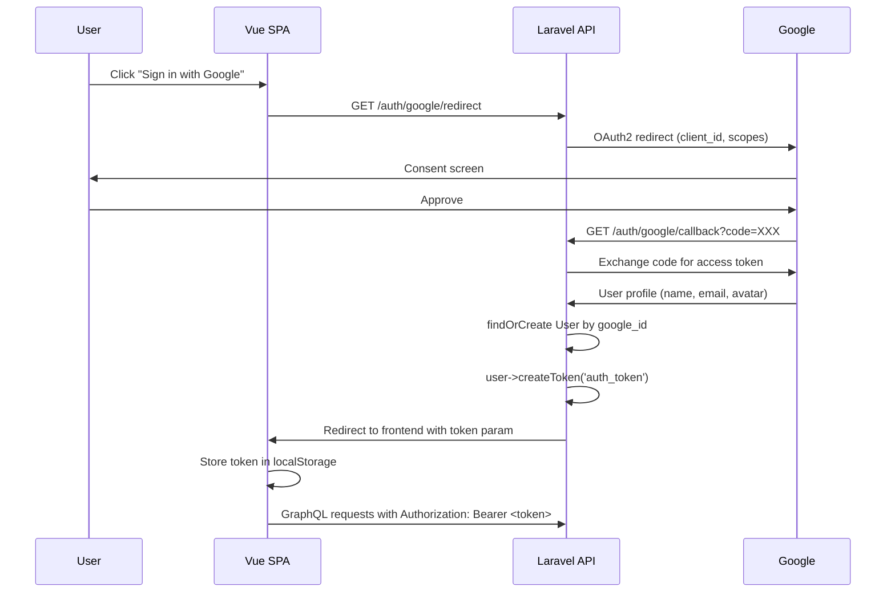

# ADR-003: Google OAuth with Socialite + Sanctum

## Status

**Accepted**

## Context

CalcTek Calculator requires user authentication so that calculation history is private and persisted per user. The authentication mechanism must be secure, low-friction for users, and straightforward to implement.

Options considered:

1. **Email/password registration** -- Traditional authentication with Laravel Fortify or Breeze.
2. **Google OAuth via Socialite + Sanctum** -- Social login with bearer token API authentication.
3. **Firebase Authentication** -- Google's managed auth service with frontend SDK.
4. **Passport (OAuth2 server)** -- Full OAuth2 server implementation in Laravel.

## Decision

Use **Google OAuth via Laravel Socialite** for user authentication, with **Laravel Sanctum** for API token management.

## Rationale

- **Zero-friction sign-in**: Users click "Sign in with Google" and authorize with their existing Google account. No registration form, no password to remember.
- **Socialite simplicity**: Laravel Socialite abstracts the entire OAuth2 flow into a few lines of code. The Google provider is first-party and well-maintained.
- **Sanctum for SPA tokens**: After OAuth completes, the backend creates a Sanctum personal access token. The frontend stores this token and sends it as a `Bearer` token with every GraphQL request. Sanctum is lightweight compared to Passport and purpose-built for SPA and mobile API authentication.
- **Separation of concerns**: Socialite handles the OAuth handshake (redirect, callback, user info retrieval). Sanctum handles the ongoing API authentication. Each package does one thing well.
- **No password storage**: By relying on Google for identity, the application never stores or manages passwords, eliminating an entire class of security concerns.

## Authentication Flow

## Consequences

- Users must have a Google account to use the application. Other OAuth providers (GitHub, Microsoft) can be added later via Socialite's driver system.
- The application depends on Google's OAuth service availability. If Google's auth servers are down, users cannot sign in.
- Sanctum tokens are long-lived by default. Token expiration and rotation policies should be considered for production hardening.
- The `GOOGLE_CLIENT_ID`, `GOOGLE_CLIENT_SECRET`, and `GOOGLE_REDIRECT_URI` must be configured in `.env` and kept secret.
