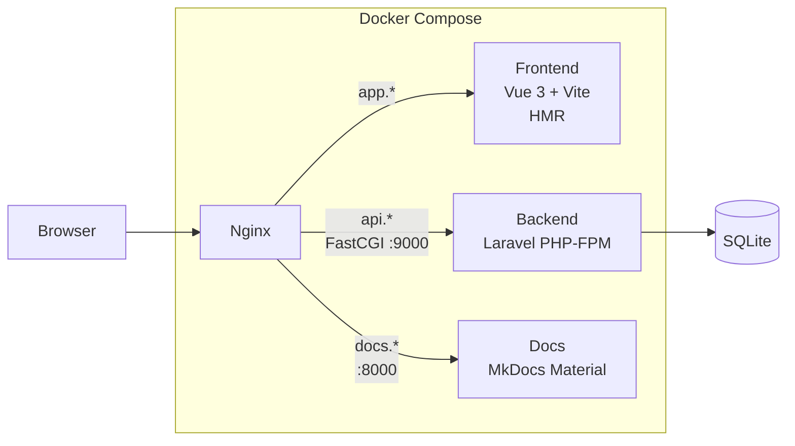

# Local Environment

Detailed guide to the local development environment and how all the pieces fit together.

## How It Works

The local environment uses Docker Compose to run four services behind an Nginx reverse proxy with mkcert-generated TLS certificates.



## Services

| Service | Container | Port | Description |
|---------|-----------|------|-------------|
| **nginx** | `calctek-calc-nginx` | 80, 443 | Reverse proxy with TLS termination |
| **backend** | `calctek-calc-backend` | 9000 (FastCGI) | Laravel 11 PHP-FPM application |
| **frontend** | `calctek-calc-frontend` | 5173 (Vite HMR) | Vue 3 dev server with hot reload |
| **docs** | `calctek-calc-docs` | 8000 | MkDocs Material live-reload server |

## Setup Steps

### 1. Run `make setup`

From the project root:

```bash
make setup
```

This is idempotent -- safe to run multiple times. See [Getting Started](getting-started.md) for what each step does.

### 2. Run `make start`

```bash
make start
```

Docker Compose brings up all services. The frontend runs `pnpm run dev --host` for Vite HMR support inside the container.

### 3. Verify

Open the following URLs in your browser:

| URL | Expected |
|-----|----------|
| [https://app.dev.calctek-calc.ai](https://app.dev.calctek-calc.ai) | Vue app with Google Sign-In |
| [https://api.dev.calctek-calc.ai/health](https://api.dev.calctek-calc.ai/health) | JSON health check response |
| [https://api.dev.calctek-calc.ai/graphql-playground](https://api.dev.calctek-calc.ai/graphql-playground) | GraphQL Playground |
| [https://docs.dev.calctek-calc.ai](https://docs.dev.calctek-calc.ai) | This documentation site |

## Volume Mounts

| Host Path | Container Path | Purpose |
|-----------|----------------|---------|
| `./backend` | `/var/www/html` | Laravel source (live reload) |
| `./frontend` | `/app` | Vue source (Vite HMR) |
| `./docs` | `/docs` | MkDocs source (live reload) |
| `./docker/ssl` | `/ssl` | TLS certificates (read-only) |
| `./docker/nginx/nginx.conf` | `/etc/nginx/nginx.conf` | Nginx config (read-only) |

!!! info
    Frontend `node_modules` use a named Docker volume (`frontend_node_modules`) to avoid syncing host `node_modules` into the container and vice versa.

## Networking

All services share the external Docker bridge network `calctek-calc-network`. The network is created by `make network` during setup.

The local IP `192.168.204.5` is assigned to a loopback alias via a macOS LaunchDaemon. DNS resolution is handled by `/etc/hosts` entries pointing `*.dev.calctek-calc.ai` subdomains to this IP.

## Database

SQLite is used as the database. The file lives at `backend/database/database.sqlite` and is mounted into the backend container. Run migrations with:

```bash
make migrate
```

## Troubleshooting

### Containers not starting

```bash
make status     # Check container state
make logs       # Check for errors
docker network ls | grep calctek  # Verify network exists
```

### SSL certificate errors

```bash
make ssl        # Regenerate certificates
mkcert -install # Ensure CA is trusted
```

### Port conflicts

Ensure no other service is listening on the local IP (`192.168.204.5`) ports 80 or 443:

```bash
lsof -i :443 -s TCP:LISTEN
```

### Frontend HMR not working

Verify the Vite dev server is running inside the container:

```bash
make logs-fe
```
