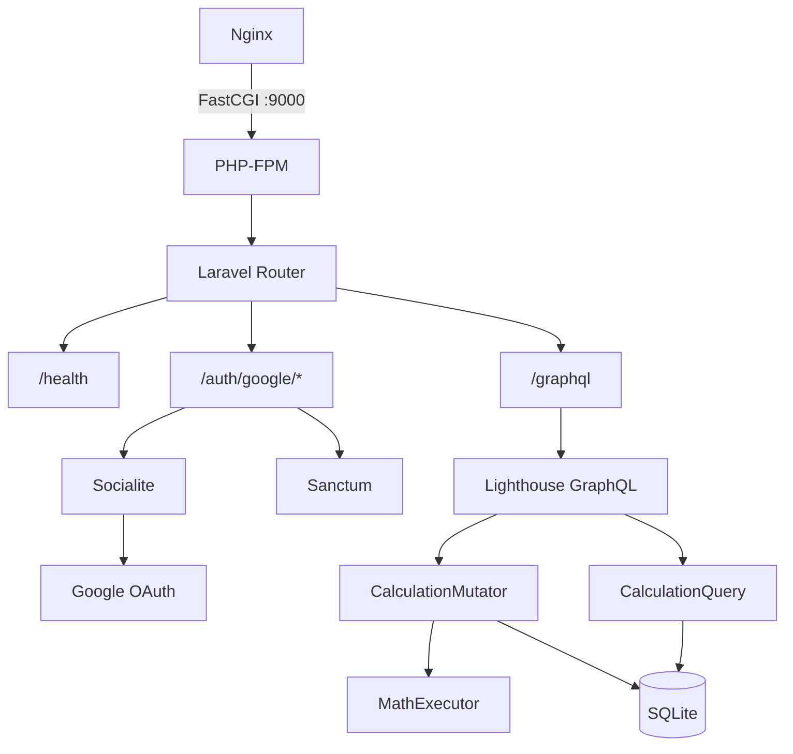
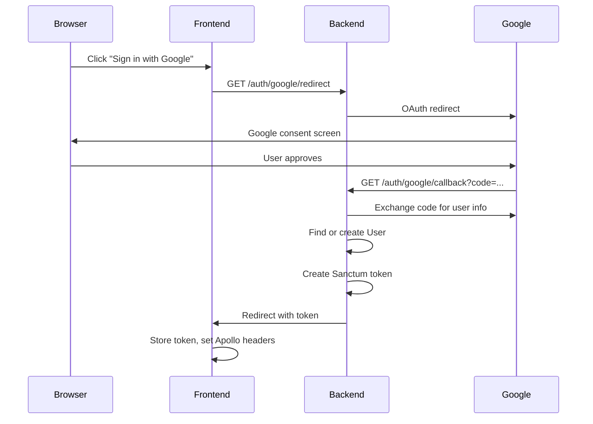

# Backend API Tech Spec

## Overview

The backend is a **Laravel 11** application serving a **GraphQL API** via the Lighthouse package. It runs as a PHP-FPM process (port 9000) behind Nginx, with Sanctum for API token authentication and Socialite for Google OAuth.

## Technology Stack

| Component | Technology | Version |
|-----------|-----------|---------|
| Framework | Laravel | 11.x |
| GraphQL | Lighthouse (nuwave/lighthouse) | Latest |
| Auth tokens | Laravel Sanctum | Latest |
| OAuth | Laravel Socialite (Google provider) | Latest |
| Math engine | MathExecutor | Latest |
| Database | SQLite | 3.x |
| Runtime | PHP-FPM | 8.3 |

## Architecture



## API Endpoints

### REST

| Method | Path | Auth | Description |
|--------|------|------|-------------|
| `GET` | `/health` | No | Health check |
| `GET` | `/auth/google/redirect` | No | Initiate Google OAuth flow |
| `GET` | `/auth/google/callback` | No | OAuth callback, returns Sanctum token |

### GraphQL (`POST /graphql`)

All GraphQL operations require a valid Sanctum bearer token in the `Authorization` header.

#### Queries

| Query | Returns | Description |
|-------|---------|-------------|
| `me` | `User` | Current authenticated user |
| `calculations` | `[Calculation!]!` | All calculations for the authenticated user |

#### Mutations

| Mutation | Input | Returns | Description |
|----------|-------|---------|-------------|
| `calculate` | `CalculateInput!` | `Calculation!` | Perform a basic arithmetic calculation |
| `evaluateExpression` | `expression: String!` | `Calculation!` | Evaluate a complex math expression |
| `deleteCalculation` | `id: ID!` | `Calculation` | Delete a single calculation |
| `clearCalculations` | -- | `Boolean!` | Delete all user calculations |

## GraphQL Schema

```graphql
scalar DateTime

type Query {
    me: User @auth
    calculations: [Calculation!]! @guard
}

type Mutation {
    calculate(input: CalculateInput!): Calculation! @guard
    evaluateExpression(expression: String!): Calculation! @guard
    deleteCalculation(id: ID!): Calculation @guard
    clearCalculations: Boolean! @guard
}

input CalculateInput {
    operand_a: Float!
    operator: String!
    operand_b: Float!
}

type Calculation {
    id: ID!
    expression: String!
    operator: String
    operand_a: Float
    operand_b: Float
    result: Float!
    created_at: DateTime!
}

type User {
    id: ID!
    name: String!
    email: String!
    avatar: String
}
```

## Key Components

### CalculationMutator

Handles all calculation-related mutations. Uses Laravel's MathExecutor package for expression evaluation, which supports:

- Basic arithmetic (`+`, `-`, `*`, `/`)
- Exponents (`^`)
- Square root (`sqrt()`)
- Parentheses for grouping
- Trigonometric functions (`sin`, `cos`, `tan`)

### Authentication Flow



## Database Schema

The SQLite database contains two primary tables:

### `users`

| Column | Type | Description |
|--------|------|-------------|
| id | integer (PK) | Auto-increment |
| name | string | Google display name |
| email | string (unique) | Google email |
| avatar | string (nullable) | Google avatar URL |
| google_id | string (unique) | Google user ID |
| created_at | timestamp | |
| updated_at | timestamp | |

### `calculations`

| Column | Type | Description |
|--------|------|-------------|
| id | integer (PK) | Auto-increment |
| user_id | integer (FK) | Owner reference |
| expression | string | Full expression string |
| operator | string (nullable) | Operator for basic calc |
| operand_a | float (nullable) | Left operand |
| operand_b | float (nullable) | Right operand |
| result | float | Computed result |
| created_at | timestamp | |
| updated_at | timestamp | |

## Running Locally

```bash
make start      # Start all containers
make migrate    # Run database migrations
make shell-be   # Shell into backend container
make tinker     # Open Laravel Tinker REPL
make logs-be    # Tail backend logs
```
