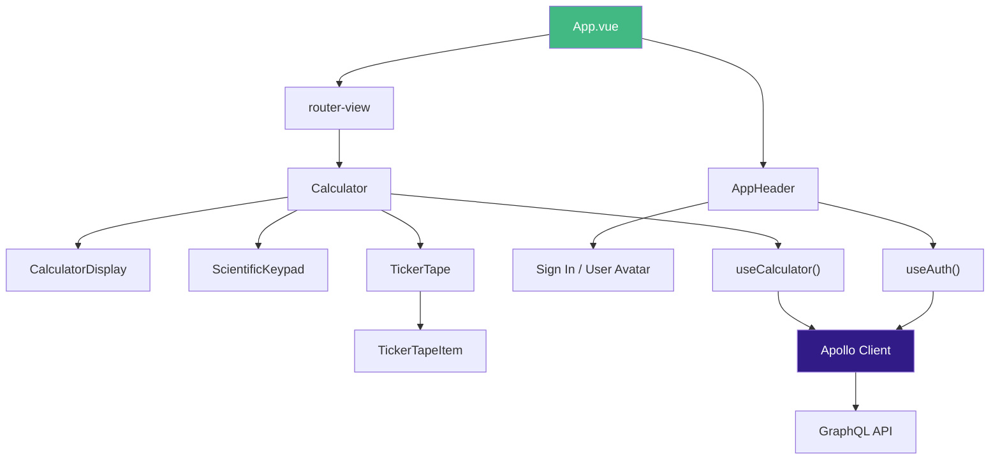

# Frontend Tech Spec

## Overview

The frontend is a **Vue 3** single-page application built with **Vite**, styled with **shadcn-vue** (Radix + Tailwind CSS), and connected to the backend via **Apollo Client** over GraphQL.

## Technology Stack

| Component | Technology |
|-----------|-----------|
| Framework | Vue 3 (Composition API) |
| Build tool | Vite |
| UI library | shadcn-vue (Radix Vue + Tailwind CSS) |
| GraphQL client | Apollo Client |
| Routing | vue-router |
| Language | TypeScript |
| Package manager | pnpm |

## Component Architecture



## Components

| Component | File | Responsibility |
|-----------|------|---------------|
| `AppHeader` | `AppHeader.vue` | Top navigation bar, user avatar, sign-in/sign-out |
| `Calculator` | `Calculator.vue` | Main calculator layout, orchestrates child components |
| `CalculatorDisplay` | `CalculatorDisplay.vue` | Shows expression being built and result |
| `ScientificKeypad` | `ScientificKeypad.vue` | Mac-style 10-column scientific calculator buttons (trig, log, powers, etc.) |
| `TickerTape` | `TickerTape.vue` | Scrollable calculation history list |
| `TickerTapeItem` | `TickerTapeItem.vue` | Single history entry with delete action |

All components live under `frontend/src/components/`. Reusable UI primitives from shadcn-vue are in `frontend/src/components/ui/`.

## Composables

The application uses Vue composables to encapsulate business logic and API interactions.

### `useAuth()`

**File:** `frontend/src/composables/useAuth.ts`

Manages authentication state and the Google OAuth flow.

- Stores the Sanctum bearer token (persisted to localStorage).
- Provides the current user object (`me` query).
- Handles sign-in redirect and token extraction from callback.
- Configures Apollo Client's `Authorization` header.

### `useCalculator()`

**File:** `frontend/src/composables/useCalculator.ts`

Manages calculator state and GraphQL operations.

- Maintains current display value, expression, and operator state.
- Calls the `calculate` mutation for basic arithmetic.
- Calls the `evaluateExpression` mutation for complex expressions.
- Fetches calculation history via the `calculations` query.
- Calls `deleteCalculation` and `clearCalculations` mutations.
- Updates the Apollo cache after mutations for instant UI updates.

## Apollo Client Configuration

Apollo Client is configured to:

- Point to the backend GraphQL endpoint (`VITE_API_URL/graphql`).
- Include the Sanctum bearer token in every request via an auth link.
- Use an in-memory cache with type policies for `Calculation` entities.

The `VITE_API_URL` environment variable determines the backend URL:

| Environment | Value |
|-------------|-------|
| Local | `https://api.dev.calctek-calc.ai` |
| Production (GKE) | `http://api.<IP>.sslip.io` |

## Routing

The app is a single-page application. Vue Router is configured for hash or history mode with no full-page reloads.

!!! warning
    The application must remain an SPA. Never trigger full page reloads -- always use `vue-router` for navigation.

## Development

The frontend runs inside a Docker container with Vite's dev server and HMR enabled:

```bash
make start      # Start all containers (frontend runs pnpm dev --host)
make logs-fe    # Tail frontend logs
make shell-fe   # Shell into frontend container
make build-fe   # Rebuild frontend container
```

Source files are mounted from `./frontend` on the host into `/app` in the container. Changes are reflected instantly via Vite HMR.

## Mobile Apps (Capacitor)

The frontend is wrapped with **CapacitorJS** for native iOS and Android distribution. See the [Mobile Apps Tech Spec](mobile.md) for full details.

```bash
make mobile-ios       # Build + open Xcode
make mobile-android   # Build + open Android Studio
make mobile-run-ios   # Live reload on iOS simulator
```
