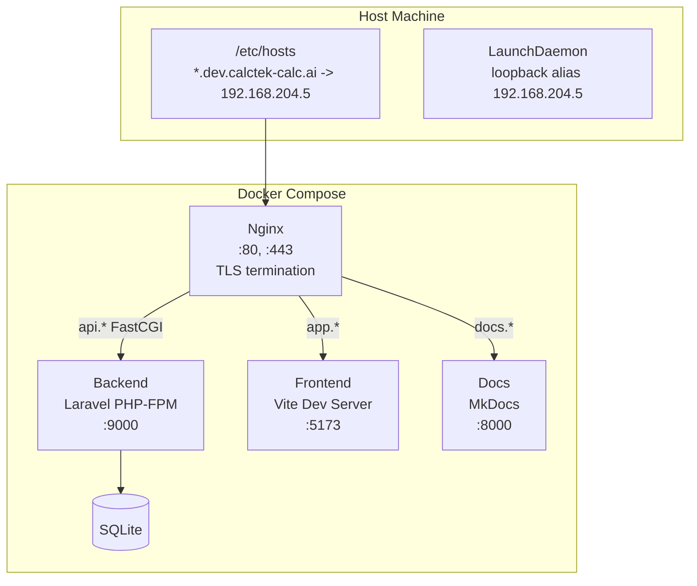
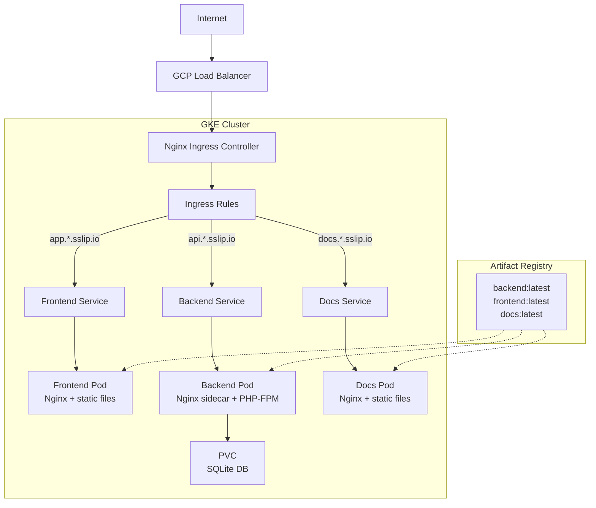

# Infrastructure Tech Spec

## Overview

CalcTek Calculator runs in two environments:

- **Local development** -- Docker Compose with Nginx reverse proxy and mkcert TLS.
- **Production** -- Google Kubernetes Engine (GKE) with Nginx Ingress Controller and sslip.io for DNS.

## Local Infrastructure (Docker Compose)



### Services

| Service | Image | Ports | Notes |
|---------|-------|-------|-------|
| nginx | `nginx:alpine` | 80, 443 | TLS via mkcert wildcard cert |
| backend | Custom (PHP-FPM) | 9000 | `docker/laravel/Dockerfile` |
| frontend | Custom (Node) | 5173 | `frontend/Dockerfile` target: development |
| docs | `squidfunk/mkdocs-material` | 8000 | Live reload |

### Networking

- External bridge network: `calctek-calc-network`
- Local IP: `192.168.204.5` (loopback alias)
- DNS: `/etc/hosts` entries for `api.dev.calctek-calc.ai`, `app.dev.calctek-calc.ai`, `docs.dev.calctek-calc.ai`
- TLS: Wildcard certificate for `*.dev.calctek-calc.ai` via mkcert

### Volumes

| Volume | Type | Purpose |
|--------|------|---------|
| `./backend:/var/www/html` | Bind mount | Laravel source (also mounted in Nginx for FastCGI) |
| `./frontend:/app` | Bind mount | Vue source |
| `./docs:/docs` | Bind mount | MkDocs source |
| `./docker/ssl:/ssl` | Bind mount (ro) | TLS certificates |
| `frontend_node_modules` | Named volume | Isolate container node_modules from host |

---

## Production Infrastructure (GKE)



### GKE Cluster

| Setting | Value |
|---------|-------|
| Cluster name | `calctek-calc-cluster` |
| Zone | `us-central1-a` |
| Machine type | `e2-medium` |
| Nodes | 1 |
| Disk size | 30 GB |

### Kubernetes Resources

| Manifest | Resource | Description |
|----------|----------|-------------|
| `namespace.yaml` | Namespace | `calctek-calc` namespace |
| `cert-issuer.yaml` | ClusterIssuer | Let's Encrypt cert-manager issuer |
| `backend-pvc.yaml` | PVC | Persistent volume for SQLite database |
| `backend-deployment.yaml` | Deployment + ConfigMap | Backend pods (PHP-FPM + Nginx sidecar) |
| `frontend-deployment.yaml` | Deployment | Frontend pods (Nginx serving static build) |
| `docs-deployment.yaml` | Deployment | Docs pods (Nginx serving MkDocs build) |
| `backend-service.yaml` | Service | ClusterIP for backend |
| `frontend-service.yaml` | Service | ClusterIP for frontend |
| `docs-service.yaml` | Service | ClusterIP for docs |
| `ingress.yaml` | Ingress | Host-based routing via Nginx Ingress |
| `configmap.yaml` | ConfigMap | Shared configuration |

### DNS (sslip.io)

Production uses [sslip.io](https://sslip.io) for DNS resolution without a registered domain. Given a LoadBalancer IP of `34.56.78.90`, the URLs become:

| Service | URL |
|---------|-----|
| Frontend | `http://app.34-56-78-90.sslip.io` |
| API | `http://api.34-56-78-90.sslip.io` |
| Docs | `http://docs.34-56-78-90.sslip.io` |

### Container Registry

Images are stored in Google Artifact Registry:

```
<region>-docker.pkg.dev/<project-id>/calctek-calc/<service>:latest
```

### Secrets

Kubernetes secrets are created from `.env` values during deployment:

| Secret Key | Source |
|------------|--------|
| `APP_KEY` | `.env` |
| `GOOGLE_CLIENT_ID` | `.env` |
| `GOOGLE_CLIENT_SECRET` | `.env` |

---

## Deployment

### Local

```bash
make setup   # One-time setup
make start   # Start containers
make stop    # Stop containers
```

### Production (GKE)

```bash
make gke-deploy-all   # Full deployment (init -> cluster -> build -> push -> deploy)
make gke-status       # Check pod status
make gke-urls         # Print live URLs
make gke-destroy      # Tear down everything
```

See the [GKE Runbook](../../operations/gke-runbook.md) for detailed operational procedures.
