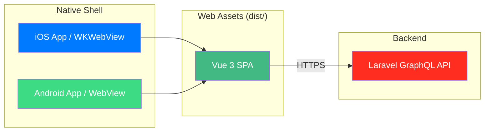
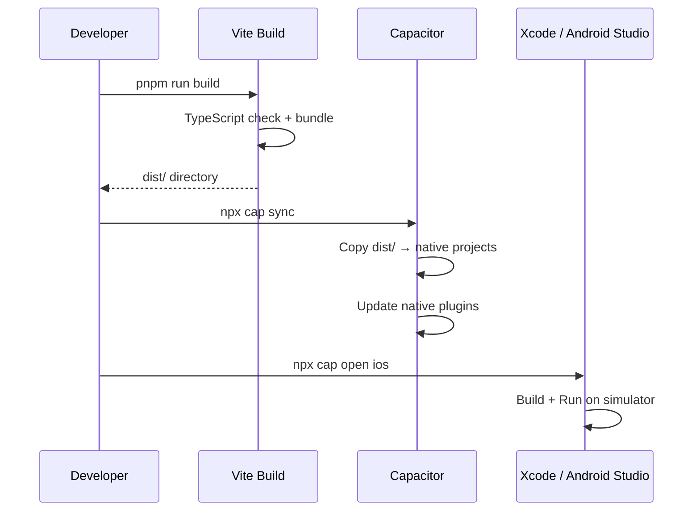

# Mobile Apps Tech Spec

**Status:** Approved

## Overview

The CalcTek Calculator is available as a native iOS and Android app via **CapacitorJS**. Capacitor wraps the existing Vue 3 SPA in a native WebView, providing native app distribution while sharing 100% of the frontend codebase.

## Technology Stack

| Component | Technology |
|-----------|-----------|
| Native wrapper | CapacitorJS 8.x |
| Web framework | Vue 3 + Vite (same as web) |
| iOS project | Xcode / Swift (generated) |
| Android project | Android Studio / Kotlin (generated) |
| Plugins | @capacitor/app, @capacitor/splash-screen, @capacitor/status-bar |

## Architecture



## Directory Structure

Capacitor lives inside `frontend/` alongside the web project:

```
frontend/
├── ios/                        # Native iOS project (Xcode)
│   └── App/
│       ├── App/
│       │   ├── capacitor.config.json
│       │   └── public/         # Copied web assets
│       └── App.xcworkspace
├── android/                    # Native Android project
│   └── app/
│       └── src/main/assets/public/  # Copied web assets
├── capacitor.config.ts         # Capacitor configuration
├── dist/                       # Vite build output (webDir)
└── package.json
```

## Configuration

**`frontend/capacitor.config.ts`:**

| Setting | Value |
|---------|-------|
| `appId` | `com.calctek.calculator` |
| `appName` | `CalcTek Calculator` |
| `webDir` | `dist` (Vite output) |
| `androidScheme` | `https` |
| `ios.scheme` | `CalcTek Calculator` |

## Build Pipeline



**Commands:**

| Command | Description |
|---------|-------------|
| `make mobile-build` | Build Vite + sync to both platforms |
| `make mobile-ios` | Build, sync, open Xcode |
| `make mobile-android` | Build, sync, open Android Studio |
| `make mobile-run-ios` | Build + run on iOS simulator with live reload |
| `make mobile-run-android` | Build + run on Android emulator with live reload |
| `make mobile-sync` | Sync web assets only (skip rebuild) |
| `make mobile-ssl-ios` | Install mkcert CA into iOS Simulator |

## Mobile-Responsive Design

The web UI is optimized for mobile viewports:

- **Touch targets:** Minimum 44px height (Apple HIG) on all calculator buttons
- **Responsive grid:** Buttons scale up on small screens (`h-11 sm:h-10`)
- **Adaptive spacing:** Tighter padding on mobile (`p-2 sm:p-4`)
- **Larger display:** Calculator result text scales up on mobile (`text-4xl sm:text-3xl`)
- **Active feedback:** Button press animation (`active:scale-95`)
- **Viewport:** `viewport-fit=cover` for edge-to-edge display on notched devices

## Capacitor Plugins

| Plugin | Purpose |
|--------|---------|
| `@capacitor/app` | App lifecycle events (back button, state changes) |
| `@capacitor/splash-screen` | Native splash screen (1.5s white) |
| `@capacitor/status-bar` | Status bar styling |

## Related Documents

- [Frontend Tech Spec](frontend.md) — Web frontend architecture
- [ADR-004: CapacitorJS](../decisions/adr-004-capacitorjs.md) — Decision to use Capacitor
- [Mobile Runbook](../../operations/mobile-runbook.md) — Build and deployment procedures
