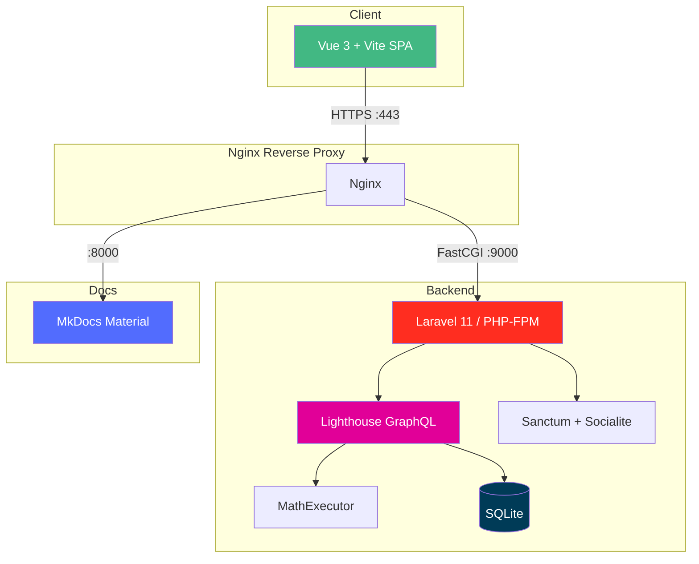

# CalcTek Calculator

An API-driven calculator built with **Laravel 11 + Lighthouse GraphQL** on the backend and **Vue 3 + Vite + shadcn-vue** on the frontend. Authenticated via Google OAuth, with persistent calculation history.

---

## Architecture



---

## Quick Links

| Section | Description |
|---------|-------------|
| [Product](product/index.md) | Product specs, user stories, and acceptance criteria |
| [Engineering](engineering/index.md) | Tech specs, onboarding guides, and architecture decisions |
| [Operations](operations/index.md) | Deployment runbooks and operational procedures |

---

## Tech Stack

| Layer | Technology |
|-------|-----------|
| **Frontend** | Vue 3, Vite, shadcn-vue, Apollo Client, TypeScript |
| **Backend** | Laravel 11, Lighthouse GraphQL, PHP 8.3 |
| **Auth** | Google OAuth via Socialite + Sanctum bearer tokens |
| **Database** | SQLite |
| **Mobile** | CapacitorJS (iOS + Android) |
| **Infrastructure** | Docker Compose (local), GKE + Nginx Ingress (prod) |
| **Docs** | MkDocs Material |

---

## Local Development URLs

| Service | URL |
|---------|-----|
| Frontend | [https://app.dev.calctek-calc.ai](https://app.dev.calctek-calc.ai) |
| Backend API | [https://api.dev.calctek-calc.ai](https://api.dev.calctek-calc.ai) |
| GraphQL Playground | [https://api.dev.calctek-calc.ai/graphql-playground](https://api.dev.calctek-calc.ai/graphql-playground) |
| Docs | [https://docs.dev.calctek-calc.ai](https://docs.dev.calctek-calc.ai) |

---

## Getting Started

```bash
make setup   # First-time setup (hosts, SSL, network, launchdaemon)
make start   # Start all containers
```

See the [Getting Started Guide](engineering/onboarding/getting-started.md) for full instructions.
